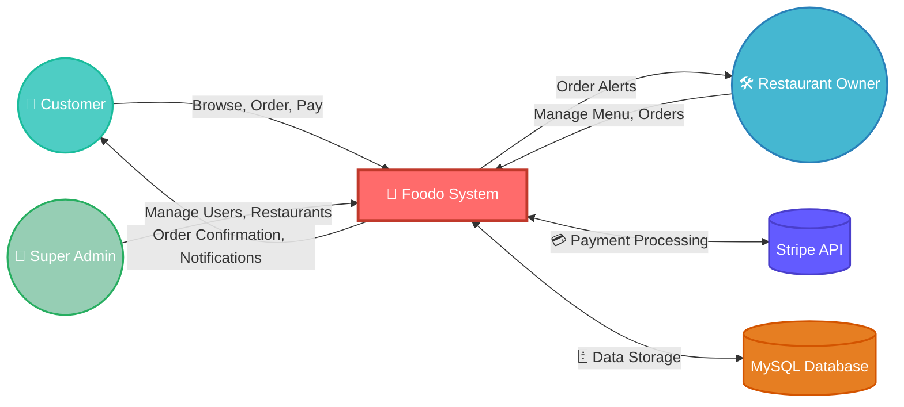
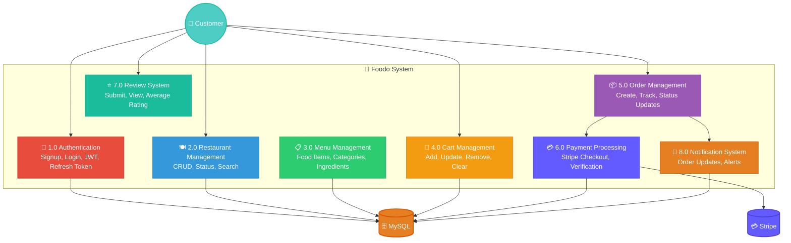
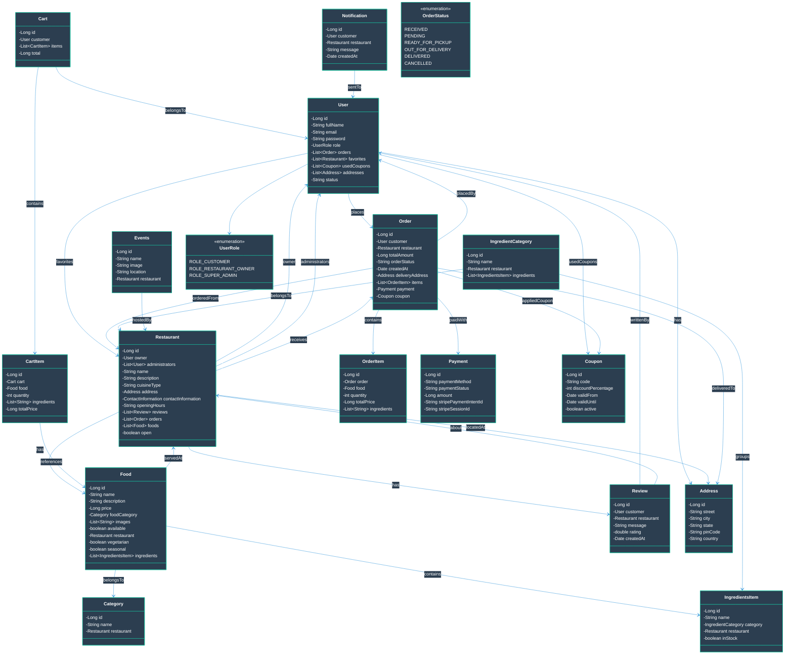
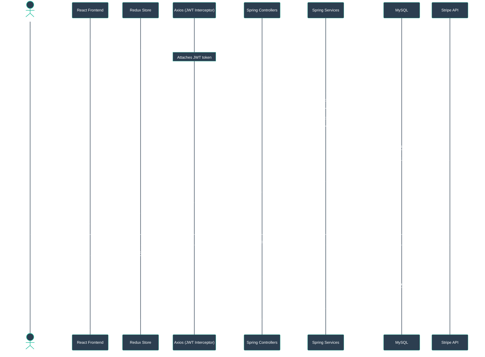
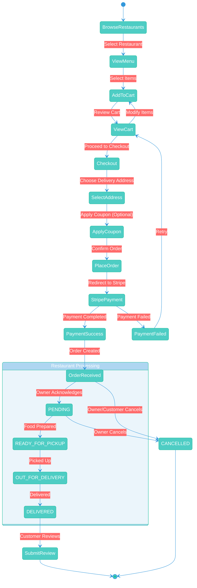
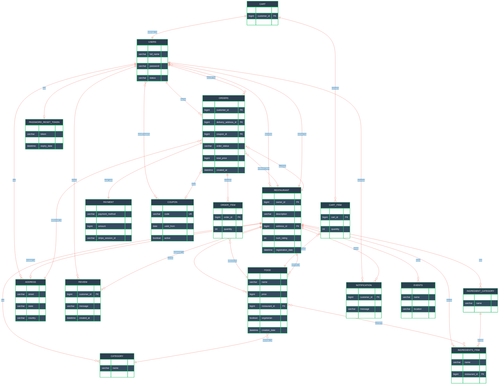

<div align="center">

# 🍔 Foodo — Food Ordering & Delivery System

**A production-grade, full-stack food ordering platform built with Spring Boot & React**


</div>

---

## 📑 Table of Contents

- [About the Project](#-about-the-project)
- [Features](#-features)
- [Tech Stack](#-tech-stack)
- [Chapter 4: System Design](#-chapter-4-system-design)
  - [4.1 System Architecture](#41-system-architecture)
  - [4.2 Data Flow Diagrams (DFD)](#42-data-flow-diagrams-dfd)
  - [4.3 UML Diagrams](#43-uml-diagrams)
    - [Use Case Diagram](#use-case-diagram)
    - [Class Diagram](#class-diagram)
    - [Sequence Diagram](#sequence-diagram)
    - [Activity Diagram](#activity-diagram)
  - [4.4 Database Design — ER Diagram](#44-database-design--er-diagram)
  - [4.5 User Interface Design](#45-user-interface-design)
- [API Endpoints](#-api-endpoints)
- [Project Structure](#-project-structure)
- [Getting Started](#-getting-started)
- [How to Explain This Project in an Interview](#-how-to-explain-this-project-in-an-interview)
- [Java Spring Boot Developer — 20 Q&A](#-java-spring-boot-developer--20-qa)

---

<details>
<summary><h2>📖 About the Project</h2></summary>

Foodo is a multi-role, full-stack food delivery platform that enables **customers** to browse restaurants, order food, and pay online via Stripe, while **restaurant owners** manage menus, ingredients, orders, events, and coupons through a dedicated dashboard. A **super admin** panel provides platform-wide user and restaurant management. The backend follows a layered architecture (Controller → Service → Repository) with DTOs, MapStruct mappers, and JWT-based stateless authentication.

</details>

---

## ✨ Features

<details>
<summary><h3>👤 Customer</h3></summary>

| Feature | Description |
|---|---|
| Browse & Search | View restaurants, search by name/keyword, filter menu items (veg, seasonal, category) |
| Cart | Add/remove items, update quantities, clear cart, auto-total calculation |
| Orders & Payments | Place orders with Stripe Checkout, verify payments, view order history |
| Reviews & Ratings | Submit reviews, view restaurant reviews, average rating calculation |
| Favorites | Toggle restaurants as favorites |
| Notifications | Real-time notification feed |
| Profile | Manage profile information, add/manage delivery addresses |

</details>

<details>
<summary><h3>🛠 Restaurant Owner (Admin)</h3></summary>

| Feature | Description |
|---|---|
| Restaurant CRUD | Create, update, delete restaurant; toggle open/closed status |
| Menu Management | Create/delete food items, update availability status |
| Category Management | Create/delete food categories per restaurant |
| Ingredient Management | Manage ingredient categories & items, toggle stock in/out |
| Order Management | View restaurant orders (filterable by status), update order status, cancel orders |
| Events | Create and manage restaurant promotional events |
| Coupons | Create, update, delete discount coupons |
| Admin Delegation | Add additional admins to a restaurant |
</details>

<details>
<summary><h3>👑 Super Admin</h3></summary>

| Feature | Description |
|---|---|
| User Management | View all customers, pending restaurant owner requests, delete users |
| Restaurant Oversight | View all restaurants (paginated), delete restaurants, toggle status |

</details>

---

<details>
<summary><h2>🛠 Tech Stack</h2></summary>


### Backend
| Technology | Purpose |
|---|---|
| **Java 21** | Core language |
| **Spring Boot 3.3** | Application framework |
| **Spring Security** | Authentication & authorization (JWT + BCrypt) |
| **Spring Data JPA** | ORM & database access |
| **MySQL 8** | Relational database |
| **Stripe API** | Payment processing |
| **MapStruct 1.6** | DTO ↔ Entity mapping |
| **Lombok** | Boilerplate reduction |
| **Jakarta Validation** | Request validation |
| **SpringDoc OpenAPI** | API documentation (Swagger UI) |
| **Spring Mail** | Email notifications (password reset) |
| **Maven** | Build tool |

### Frontend
| Technology | Purpose |
|---|---|
| **React 18** | UI library |
| **Redux + Redux Thunk** | State management |
| **Tailwind CSS 3** | Utility-first styling |
| **React Router DOM 6** | Client-side routing |
| **Axios** | HTTP client with interceptors & refresh token |
| **Formik + Yup** | Form handling & validation |
| **Lucide React** | Icon library |
| **React Slick** | Carousel/slider components |

</details>

---

<details open>
<summary><h2>📐 Chapter 4: System Design</h2></summary>


### 4.1 System Architecture

The system follows a **3-Tier Architecture** with a React SPA frontend communicating with a Spring Boot REST API backend, which persists data in a MySQL database and integrates with Stripe for payment processing.

```
┌─────────────────────────────────────────────────────────────────────┐
│                        CLIENT TIER                                  │
│  ┌───────────────────────────────────────────────────────────────┐  │
│  │  React 18 SPA (Tailwind CSS)                                 │  │
│  │  ┌─────────┐  ┌──────────┐  ┌──────────┐  ┌──────────────┐  │  │
│  │  │ Customer │  │  Admin   │  │  Super   │  │  Auth Pages  │  │  │
│  │  │  Pages   │  │Dashboard │  │  Admin   │  │ Login/Signup │  │  │
│  │  └────┬─────┘  └────┬─────┘  └────┬─────┘  └──────┬───────┘  │  │
│  │       └──────────────┴─────────────┴───────────────┘          │  │
│  │                 Redux Store (Thunk Middleware)                 │  │
│  │                 Axios HTTP Client (JWT Interceptor)            │  │
│  └───────────────────────────┬───────────────────────────────────┘  │
└──────────────────────────────┼──────────────────────────────────────┘
                               │ REST API (JSON)
                               ▼
┌──────────────────────────────────────────────────────────────────────┐
│                       APPLICATION TIER                               │
│  ┌────────────────────────────────────────────────────────────────┐  │
│  │  Spring Boot 3.3 (Java 21)                                    │  │
│  │                                                                │  │
│  │  ┌──────────────┐   ┌───────────────┐   ┌──────────────────┐  │  │
│  │  │  Controllers │──▶│   Services    │──▶│  Repositories    │  │  │
│  │  │  (16 REST)   │   │  (16 impls)   │   │  (JPA/Hibernate) │  │  │
│  │  └──────────────┘   └───────────────┘   └──────────────────┘  │  │
│  │                                                                │  │
│  │  ┌────────────────┐  ┌────────────┐  ┌─────────────────────┐  │  │
│  │  │ Security Layer │  │  Mappers   │  │  Exception Handlers │  │  │
│  │  │ JWT + BCrypt   │  │ (MapStruct)│  │  (Global Advice)    │  │  │
│  │  └────────────────┘  └────────────┘  └─────────────────────┘  │  │
│  └────────────────────────────┬───────────────────────────────────┘  │
└───────────────────────────────┼──────────────────────────────────────┘
                                │ JDBC
                                ▼
┌───────────────────────────────────────────────────────────────────────┐
│                         DATA TIER                                     │
│  ┌──────────────┐   ┌────────────────┐   ┌────────────────────────┐  │
│  │   MySQL 8    │   │  Stripe API    │   │  SMTP Mail Server     │  │
│  │  (19 Tables) │   │  (Payments)    │   │  (Password Reset)     │  │
│  └──────────────┘   └────────────────┘   └────────────────────────┘  │
└───────────────────────────────────────────────────────────────────────┘
```

---

### 4.2 Data Flow Diagrams (DFD)

#### Level 0 — Context Diagram



#### Level 1 — Major Processes



---

### 4.3 UML Diagrams

#### Use Case Diagram

```mermaid
graph TB
    classDef green fill:#27AE60,stroke:#1E8449,color:#fff,stroke-width:2px
    classDef blue fill:#2980B9,stroke:#1F618D,color:#fff,stroke-width:2px
    classDef gold fill:#E67E22,stroke:#D35400,color:#fff,stroke-width:2px

    subgraph "🍔 Foodo — Use Cases"
        subgraph "🟢 Customer Actions"
            UC1[Register / Login]
            UC2[Browse Restaurants]
            UC3[Search Food Items]
            UC4[Add to Cart]
            UC5[Place Order]
            UC6[Make Payment via Stripe]
            UC7[View Order History]
            UC8[Submit Review]
            UC9[Toggle Favorite Restaurant]
            UC10[Manage Addresses]
            UC11[View Notifications]
            UC12[Reset Password]
        end

        subgraph "🔵 Restaurant Owner Actions"
            UC13[Create / Update Restaurant]
            UC14[Manage Menu Items]
            UC15[Manage Categories]
            UC16[Manage Ingredients & Stock]
            UC17[View & Update Order Status]
            UC18[Create Events]
            UC19[Manage Coupons]
            UC20[Add Admin to Restaurant]
        end

        subgraph "🟡 Super Admin Actions"
            UC21[View All Customers]
            UC22[Approve Pending Owners]
            UC23[Delete Users]
            UC24[Manage All Restaurants]
        end
    end

    C((👤 Customer)) --> UC1 & UC2 & UC3 & UC4 & UC5 & UC6 & UC7 & UC8 & UC9 & UC10 & UC11 & UC12
    O((🛠 Restaurant Owner)) --> UC13 & UC14 & UC15 & UC16 & UC17 & UC18 & UC19 & UC20
    SA((👑 Super Admin)) --> UC21 & UC22 & UC23 & UC24

    style C fill:#4ECDC4,stroke:#1ABC9C,stroke-width:2px,color:#fff
    style O fill:#45B7D1,stroke:#2980B9,stroke-width:2px,color:#fff
    style SA fill:#E67E22,stroke:#D35400,stroke-width:2px,color:#fff
    class UC1,UC2,UC3,UC4,UC5,UC6,UC7,UC8,UC9,UC10,UC11,UC12 green
    class UC13,UC14,UC15,UC16,UC17,UC18,UC19,UC20 blue
    class UC21,UC22,UC23,UC24 gold
```



#### Class Diagram



#### Sequence Diagram — Place Order Flow



#### Activity Diagram — Order Lifecycle



---

### 4.4 Database Design — ER Diagram



---

### 4.5 User Interface Design

The application features three distinct UI areas:

| Panel | Pages | Key Components |
|---|---|---|
| **Customer App** | Home, Restaurant List, Restaurant Detail, Menu, Cart, Checkout, Order History, Profile, Favorites, Notifications | Navbar, RestaurantCard, MenuItemCard, CartDrawer, AddressForm, OrderStatusTracker |
| **Admin Dashboard** | Dashboard, Menu Management, Category Management, Ingredients, Orders, Events, Coupons, Restaurant Settings | Sidebar, DataTables, FormDialogs, StatusBadges, StockToggle |
| **Super Admin** | Customer Management, Restaurant Management | UserTable, RestaurantTable, StatusActions |

**UI Flow:**

```
┌──────────────────────────────────────────────────────────────┐
│                    CUSTOMER JOURNEY                           │
│                                                              │
│  Login/Signup → Home → Search Restaurants → Restaurant Page  │
│       → Browse Menu (filter: veg/seasonal/category)          │
│       → Add to Cart → Cart Page → Apply Coupon              │
│       → Select Address → Stripe Checkout → Order Confirm     │
│       → Track Order Status → Submit Review                   │
└──────────────────────────────────────────────────────────────┘

┌──────────────────────────────────────────────────────────────┐
│                  ADMIN DASHBOARD JOURNEY                      │
│                                                              │
│  Login → Dashboard → Manage Menu Items (CRUD)                │
│       → Manage Categories → Manage Ingredients (Stock)       │
│       → View Orders → Update Order Status                    │
│       → Create Events → Manage Coupons                      │
│       → Update Restaurant Settings                           │
└──────────────────────────────────────────────────────────────┘
```

</details>

---

<details>
<summary><h2>📡 API Endpoints</h2></summary>


> Base URL: `/api/v1`  
> Auth: JWT Bearer Token in `Authorization` header  
> Response format: `{ "data": {...}, "message": "...", "success": true }`

### 🔐 Authentication (`/api/v1/auth`) — Public

| Method | Endpoint | Description |
|--------|----------|-------------|
| `POST` | `/auth/signup` | Register a new user |
| `POST` | `/auth/signin` | Login and get JWT tokens |
| `POST` | `/auth/refresh` | Refresh access token |
| `POST` | `/auth/reset-password-request` | Send password reset email |
| `POST` | `/auth/reset-password` | Reset password with token |

### 👤 User (`/api/v1/users`) — Authenticated

| Method | Endpoint | Description |
|--------|----------|-------------|
| `GET` | `/users/profile` | Get current user profile |
| `POST` | `/users/address` | Add delivery address |

### 🍽 Restaurants (`/api/v1/restaurants`) — Public

| Method | Endpoint | Description |
|--------|----------|-------------|
| `GET` | `/restaurants` | List all restaurants (paginated) |
| `GET` | `/restaurants/{id}` | Get restaurant by ID |
| `GET` | `/restaurants/search?keyword=` | Search restaurants |
| `PUT` | `/restaurants/{id}/add-favorites` | Toggle favorite (Auth required) |

### 🍽 Admin Restaurants (`/api/v1/admin/restaurants`) — Owner/Admin

| Method | Endpoint | Description |
|--------|----------|-------------|
| `POST` | `/admin/restaurants` | Create a restaurant |
| `PUT` | `/admin/restaurants/{id}` | Update restaurant details |
| `DELETE` | `/admin/restaurants/{id}` | Delete a restaurant |
| `PUT` | `/admin/restaurants/{id}/status` | Toggle open/closed |
| `PUT` | `/admin/restaurants/{id}/add-admin` | Add admin to restaurant |
| `GET` | `/admin/restaurants/user` | Get owner's restaurant |
| `GET` | `/admin/restaurants` | List all restaurants (paginated) |

### 🍔 Food / Menu Items (`/api/v1/food`) — Public

| Method | Endpoint | Description |
|--------|----------|-------------|
| `GET` | `/food/search?name=` | Search food items |
| `GET` | `/food/restaurant/{restaurantId}` | Get menu by restaurant (filters: vegetarian, seasonal, nonveg, food_category) |

### 🍔 Admin Food (`/api/v1/admin/food`) — Owner/Admin

| Method | Endpoint | Description |
|--------|----------|-------------|
| `POST` | `/admin/food` | Create food item |
| `DELETE` | `/admin/food/{id}` | Delete food item |
| `GET` | `/admin/food/search?name=` | Search food items |
| `PUT` | `/admin/food/{id}` | Toggle availability |

### 🛒 Cart (`/api/v1`) — Customer

| Method | Endpoint | Description |
|--------|----------|-------------|
| `PUT` | `/cart/add` | Add item to cart |
| `PUT` | `/cart-item/update` | Update cart item quantity |
| `DELETE` | `/cart-item/{id}/remove` | Remove item from cart |
| `GET` | `/cart/` | Get user's cart |
| `GET` | `/cart/total?cartId=` | Get cart total |
| `PUT` | `/cart/clear` | Clear entire cart |
| `GET` | `/carts/{cartId}/items` | Get cart items |

### 📦 Orders (`/api/v1`) — Customer

| Method | Endpoint | Description |
|--------|----------|-------------|
| `POST` | `/order` | Create order (returns Stripe session URL) |
| `GET` | `/order/user` | Get user's order history |
| `GET` | `/payment/verify?session_id=` | Verify Stripe payment |

### 📦 Admin Orders (`/api/v1/admin`) — Owner/Admin

| Method | Endpoint | Description |
|--------|----------|-------------|
| `GET` | `/admin/order/restaurant/{restaurantId}` | Get restaurant orders (filter: order_status) |
| `PUT` | `/admin/order/{orderId}/{orderStatus}` | Update order status |
| `DELETE` | `/admin/order/{orderId}` | Cancel/delete order |

### 📁 Categories (`/api/v1/admin`) — Owner/Admin

| Method | Endpoint | Description |
|--------|----------|-------------|
| `POST` | `/admin/category` | Create category |
| `GET` | `/admin/category/restaurant/{id}` | Get restaurant categories |
| `DELETE` | `/admin/category/{id}` | Delete category |

### 🧂 Ingredients (`/api/v1/admin/ingredients`) — Owner/Admin

| Method | Endpoint | Description |
|--------|----------|-------------|
| `POST` | `/admin/ingredients/category` | Create ingredient category |
| `POST` | `/admin/ingredients` | Create ingredient item |
| `PUT` | `/admin/ingredients/{id}/stock` | Toggle stock status |
| `GET` | `/admin/ingredients/restaurant/{id}` | Get restaurant ingredients |
| `GET` | `/admin/ingredients/restaurant/{id}/category` | Get ingredient categories |
| `DELETE` | `/admin/ingredients/{id}` | Delete ingredient |
| `DELETE` | `/admin/ingredients/category/{id}` | Delete ingredient category |

### 🎉 Events (`/api/v1`) — Public / Admin

| Method | Endpoint | Description |
|--------|----------|-------------|
| `GET` | `/events` | Get all events (Public) |
| `POST` | `/admin/events/restaurant/{restaurantId}` | Create event (Admin) |
| `GET` | `/admin/events/restaurant/{restaurantId}` | Get restaurant events (Admin) |
| `DELETE` | `/admin/events/{id}` | Delete event (Admin) |

### ⭐ Reviews (`/api/v1`) — Public / Authenticated

| Method | Endpoint | Description |
|--------|----------|-------------|
| `POST` | `/review` | Submit review (Auth required) |
| `DELETE` | `/review/{reviewId}` | Delete review |
| `GET` | `/review/restaurant/{restaurantId}` | Get restaurant reviews (Public) |
| `GET` | `/review/restaurant/{restaurantId}/average-rating` | Get average rating (Public) |

### 🔔 Notifications (`/api/v1`) — Authenticated

| Method | Endpoint | Description |
|--------|----------|-------------|
| `GET` | `/notifications` | Get user notifications |

### 🎟 Coupons (`/api/v1/admin/coupons`) — Owner/Admin

| Method | Endpoint | Description |
|--------|----------|-------------|
| `POST` | `/admin/coupons` | Create coupon |
| `GET` | `/admin/coupons` | List all coupons |
| `PUT` | `/admin/coupons/{id}` | Update coupon |
| `DELETE` | `/admin/coupons/{id}` | Delete coupon |

### 👑 Super Admin (`/api/v1/super-admin`) — Super Admin Only

| Method | Endpoint | Description |
|--------|----------|-------------|
| `GET` | `/super-admin/customers` | Get all customers |
| `GET` | `/super-admin/pending-customers` | Get pending owner requests |
| `DELETE` | `/super-admin/customers/{email}` | Delete user by email |
| `GET` | `/super-admin/restaurants` | Get all restaurants (paginated) |
| `DELETE` | `/super-admin/restaurants/{id}` | Delete restaurant |
| `PUT` | `/super-admin/restaurants/{id}/status` | Toggle restaurant status |

</details>

---

<details>
<summary><h2>📂 Project Structure</h2></summary>


```
Foodo/
├── backend-spring boot/                 # Spring Boot Backend
│   ├── src/main/java/com/himanshu/
│   │   ├── HimanshuFoodApplication.java # Main entry point
│   │   ├── config/                      # Security, CORS, Stripe, OpenAPI configs
│   │   │   ├── SecurityConfig.java
│   │   │   ├── CorsConfig.java
│   │   │   ├── StripeConfig.java
│   │   │   ├── OpenApiConfig.java
│   │   │   └── security/               # JWT filter, token provider, entry point
│   │   ├── controller/                  # 16 REST controllers
│   │   ├── service/                     # Service interfaces + 16 implementations
│   │   ├── repository/                  # 16 JPA repositories
│   │   ├── model/
│   │   │   ├── entity/                  # 19 JPA entities
│   │   │   └── enums/                   # UserRole, OrderStatus
│   │   ├── dto/
│   │   │   ├── request/                 # 18 request DTOs
│   │   │   ├── response/               # 18 response DTOs
│   │   │   └── ApiResponse.java        # Unified API response wrapper
│   │   ├── mapper/                      # 9 MapStruct mappers
│   │   ├── exception/                   # Custom exceptions + global handler
│   │   └── util/                        # Utility classes
│   └── pom.xml                          # Maven dependencies
│
├── src/                                 # React Frontend
│   ├── admin/                           # Admin dashboard components
│   ├── components/                      # Shared UI components (Navbar, etc.)
│   ├── config/                          # API base URL, Axios config
│   ├── customers/                       # Customer-facing pages
│   ├── data/                            # Static data/constants
│   ├── routers/                         # React Router configuration
│   ├── state/                           # Redux store
│   │   ├── authentication/              # Auth actions, reducers
│   │   ├── customers/                   # Cart, Menu, Orders, Restaurant, Review
│   │   ├── admin/                       # Coupon, Ingredients, Order, Restaurant
│   │   ├── superAdmin/                  # Super admin state
│   │   └── store/                       # Redux store setup
│   ├── superAdmin/                      # Super admin pages
│   └── theme/                           # Dark/Light theme config
│
├── package.json                         # Frontend dependencies
└── tailwind.config.js                   # Tailwind CSS configuration
```

</details>

---

<details>
<summary><h2>⚡ Getting Started</h2></summary>


### Prerequisites

- **Java 21** (JDK)
- **Maven 3.8+**
- **Node.js 18+** & npm
- **MySQL 8.0**
- **Stripe Account** (for payment testing)

### Backend Setup

```bash
# 1. Clone the repository
git clone https://github.com/himanshugupta91/Foodo-food-ordering-System.git
cd Foodo-food-ordering-System/backend-spring\ boot

# 2. Configure application.properties
#    Set your MySQL credentials, JWT secret, Stripe API keys, and SMTP config

# 3. Create the database
mysql -u root -p -e "CREATE DATABASE foodo_db;"

# 4. Build and run
./mvnw spring-boot:run
# Backend starts at http://localhost:5467
```

### Frontend Setup

```bash
# 1. Navigate to frontend
cd Foodo-food-ordering-System

# 2. Install dependencies
npm install

# 3. Start development server
npm start
# Frontend starts at http://localhost:3000
```

### Environment Variables (Backend — `application.properties`)

```properties
# Database
spring.datasource.url=jdbc:mysql://localhost:3306/foodo_db
spring.datasource.username=root
spring.datasource.password=your_password

# JWT
app.jwt.secret=your_jwt_secret_key
app.jwt.expiration=86400000

# Stripe
stripe.api.key=sk_test_your_stripe_key

# Mail (for password reset)
spring.mail.host=smtp.gmail.com
spring.mail.port=587
spring.mail.username=your_email
spring.mail.password=your_app_password
```

</details>

---

<details>
<summary><h2>🗣️ How to Explain This Project in an Interview</h2></summary>


> **"I built Foodo, a full-stack food ordering platform using Spring Boot 3.3 (Java 21) for the backend and React 18 with Redux for the frontend. The system supports three roles — Customer, Restaurant Owner, and Super Admin — each with distinct dashboards and access controls enforced via Spring Security with JWT-based stateless authentication and role-based authorization.**
>
> **The backend follows a clean layered architecture: Controllers handle HTTP endpoints, Services encapsulate business logic (like order creation with Stripe Checkout integration, coupon discount calculations, and ingredient stock management), and Spring Data JPA Repositories manage persistence against a MySQL database with 19 normalized tables. I used MapStruct for DTO mapping to decouple API contracts from JPA entities, and Jakarta Bean Validation for input sanitization.**
>
> **On the frontend, I used Redux with Thunk middleware for async state management, Axios with a JWT refresh-token interceptor for seamless session handling, and Tailwind CSS for responsive, utility-first styling. Key features include restaurant search with filtering, full cart lifecycle management, Stripe payment processing with server-side verification, a review/rating system, coupon management, and real-time notifications.**
>
> **The project gave me deep hands-on experience with production patterns like global exception handling, pagination with Spring Data, secure password reset via email tokens, and multi-role access control with Spring Security filter chains."**

</details>

---

<details>
<summary><h2>❓ Java Spring Boot Developer — 20 Q&A</h2></summary>


### 🔐 Security & Authentication

**Q1: How does authentication work in this project?**

The project uses JWT-based stateless authentication. When a user logs in via `/api/v1/auth/signin`, the `AuthService` validates credentials against BCrypt-hashed passwords stored in MySQL, generates an access token and a refresh token using the JJWT library, and returns both. Every subsequent API request includes the access token in the `Authorization` header. The `JwtTokenValidator` filter (registered before `BasicAuthenticationFilter` in the Spring Security filter chain) extracts, validates, and populates the `SecurityContext` with the user's role. The session policy is set to `STATELESS` so no server-side session is ever created.

**Q2: How is role-based access control implemented?**

Spring Security's `HttpSecurity` configuration in `SecurityConfig.java` defines URL-pattern matchers with role constraints evaluated in order. `/api/v1/super-admin/**` requires `ROLE_SUPER_ADMIN`, `/api/v1/admin/**` requires `ROLE_RESTAURANT_OWNER` or `ROLE_SUPER_ADMIN`, `/api/v1/cart/**` and `/api/v1/order/**` require `ROLE_CUSTOMER`, while public endpoints like `/api/v1/auth/**`, `/api/v1/restaurants/**`, and `/api/v1/food/**` are `permitAll()`. The `UserRole` enum maps these roles, and the JWT token carries the role claim so the filter chain can enforce access without database lookups on every request.

**Q3: How does the refresh token mechanism work?**

When the access token expires, the frontend Axios interceptor catches the 401 response, automatically calls `POST /api/v1/auth/refresh` with the stored refresh token, receives a new access token, updates Redux state, and retries the original failed request transparently. On the backend, `AuthService.refreshAccessToken()` validates the refresh token, extracts the user email, and issues a fresh access token. This ensures uninterrupted user sessions without forcing re-login.

**Q4: How is password reset implemented securely?**

The password reset flow involves two endpoints. First, `POST /api/v1/auth/reset-password-request?email=` generates a unique `PasswordResetToken` entity with an expiry timestamp, persists it in the database, and sends an email with the token link via Spring Mail and SMTP. Second, `POST /api/v1/auth/reset-password` accepts the token and new password, validates the token hasn't expired, hashes the new password with BCrypt, updates the user record, and deletes the consumed token — all within a transactional service call.

---

### ⚙️ Spring Boot & Backend Architecture

**Q5: Explain the layered architecture of the backend.**

The backend follows a strict 3-layer architecture: **Controllers** handle HTTP request/response mapping and delegate to **Services** which encapsulate all business logic and transactional behavior. Services interact with **Repositories** (Spring Data JPA interfaces extending `JpaRepository`) for database operations. DTOs (request/response) decouple the API contract from JPA entities, and MapStruct mappers handle the conversion. Cross-cutting concerns like exception handling are centralized in a `@ControllerAdvice` global exception handler, and validation is handled via Jakarta Bean Validation annotations on request DTOs.

**Q6: Why did you use MapStruct instead of manual mapping?**

MapStruct generates compile-time type-safe mapping code, which is significantly faster than reflection-based mappers like ModelMapper. It catches mapping errors at compile time rather than runtime, produces zero-overhead plain Java code, and integrates seamlessly with Lombok via the `lombok-mapstruct-binding` dependency. In this project, 9 mapper interfaces handle all entity-to-DTO conversions, keeping controllers thin and preventing accidental exposure of sensitive fields like passwords or lazy-loaded associations.

**Q7: How do you handle exceptions globally?**

The project defines custom exceptions (`UserException`, `RestaurantException`, `FoodException`, `OrderException`, `CartException`, `CartItemException`, `ReviewException`, `CouponException`) and a global `@ControllerAdvice` handler that catches these exceptions and returns standardized `ApiResponse` objects with appropriate HTTP status codes. This ensures consistent error responses across all 66+ API endpoints without try-catch blocks scattered in controllers. The unified `ApiResponse<T>` wrapper provides `data`, `message`, and `success` fields in every response.

**Q8: How does pagination work in the application?**

Restaurant listing endpoints accept `page` and `size` query parameters. The service layer passes these to `restaurantRepository.findAll(PageRequest.of(page, size))`, which returns a `Page<Restaurant>` object from Spring Data. This is then mapped to `Page<RestaurantDto>` using `.map()` and returned to the client. The `Page` object includes metadata like `totalElements`, `totalPages`, `size`, and `number`, enabling the frontend to render pagination controls. This approach avoids loading the entire dataset into memory.

**Q9: How is the unified API response structure designed?**

Every endpoint returns `ApiResponse<T>` — a generic wrapper class with `data` (the payload), `message` (human-readable status), and `success` (boolean). Static factory methods `ApiResponse.success()` and `ApiResponse.failure()` ensure consistency. This standardization means the frontend can have a single response interceptor that checks `success` to determine if the request succeeded, and always finds the payload in `data` regardless of which endpoint was called.

**Q10: How does Swagger/OpenAPI documentation work?**

The project includes `springdoc-openapi-starter-webmvc-ui` (v2.5.0) dependency and an `OpenApiConfig.java` configuration class. SpringDoc automatically scans all `@RestController` classes, generates an OpenAPI 3.0 spec from the endpoint mappings, request/response types, and validation annotations, and serves an interactive Swagger UI at `/swagger-ui.html`. This provides a live, testable API documentation page that stays in sync with the actual code without manual maintenance.

---

### 💳 Payment & Order Processing

**Q11: How is Stripe payment integrated?**

When a customer places an order, `OrderService.createOrder()` builds the order entity, calculates totals (applying any coupon discount), saves it to the database, then calls `PaymentService` which uses the Stripe Java SDK to create a Checkout Session with line items, success/cancel URLs, and the order metadata. The Stripe session URL is returned to the frontend, which redirects the user to Stripe's hosted payment page. After payment, Stripe redirects back to the app, and the frontend calls `GET /api/v1/payment/verify?session_id=` to verify the session status server-side and update the order/payment records accordingly.

**Q12: How does the order lifecycle work?**

An order transitions through these statuses: `RECEIVED → PENDING → READY_FOR_PICKUP → OUT_FOR_DELIVERY → DELIVERED`. The customer creates an order (status: RECEIVED), the restaurant owner acknowledges it (PENDING), marks it ready (READY_FOR_PICKUP), dispatches it (OUT_FOR_DELIVERY), and confirms delivery (DELIVERED). At any point before delivery, it can be `CANCELLED`. Status updates are handled by `PUT /api/v1/admin/order/{orderId}/{orderStatus}`, which validates the transition and updates the database. Notifications are created for relevant status changes.

**Q13: How does the coupon discount system work?**

Admins create coupons with a code, discount percentage, validity period, and active flag via `POST /api/v1/admin/coupons`. When a customer places an order with a coupon, `OrderService` validates the coupon exists, is active, hasn't expired, and hasn't been already used by this customer (checked against `user.usedCoupons`). If valid, the discount percentage is applied to the total, the discount amount is stored on the order, and the coupon is added to the user's `usedCoupons` list to prevent reuse. This logic runs within a `@Transactional` service method ensuring atomicity.

---

### ⚛️ React & Frontend

**Q14: How is state management handled in the frontend?**

The frontend uses Redux with Redux Thunk middleware for managing global asynchronous state. The store is organized into domain-specific modules: `authentication` (login, signup, JWT tokens), `customers/Cart` (cart items, totals), `customers/Menu` (food items), `customers/Orders` (order history), `customers/Restaurant` (restaurant data), `customers/Review` (reviews), `admin/` (restaurant, orders, ingredients, coupons), and `superAdmin/`. Each module has its own action types, action creators (async thunks making Axios calls), and reducers. This modular structure keeps the state predictable and each domain's logic isolated.

**Q15: How does the Axios interceptor handle token refresh?**

The `api.js` file configures an Axios response interceptor that catches 401 responses. When detected, it reads the refresh token from Redux state, calls `POST /api/v1/auth/refresh` to get a new access token, updates the Redux store with the new token, sets the new token on the failed request's `Authorization` header, and retries the original request. A flag prevents multiple simultaneous refresh attempts, and queued requests wait for the refresh to complete before retrying. This ensures seamless user experience without session interruption.

---

### 🗃 Database & ORM

**Q16: How are JPA entity relationships designed?**

The data model uses a mix of JPA relationships: `@OneToOne` (User↔Cart, Order↔Payment), `@OneToMany` / `@ManyToOne` (Restaurant→Foods, Order→OrderItems, Cart→CartItems), and `@ManyToMany` (User↔Favorites, Food↔Ingredients, User↔UsedCoupons). Lazy fetching (`FetchType.LAZY`) is used by default to avoid N+1 queries, with `cascade = CascadeType.ALL` and `orphanRemoval = true` where parent-child lifecycle is tightly coupled (e.g., Cart→CartItems, Restaurant→Reviews). `@Builder.Default` ensures collections are initialized to empty lists, preventing null pointer issues.

**Q17: How do you prevent the N+1 query problem?**

Most relationships are set to `FetchType.LAZY` so associated data is loaded only when explicitly accessed. The DTO layer (via MapStruct) controls which fields are serialized, preventing unnecessary lazy-loading triggers. `@JsonIgnore` on back-references (e.g., `Order.restaurant`, `Food.restaurant`) prevents infinite serialization loops and unintended lazy loads during JSON serialization. For cases where associated data is needed, the service layer explicitly fetches it in the same transaction, allowing Hibernate to batch queries efficiently.

---

### 🏗 System Design & Scalability

**Q18: How would you scale this application for production?**

For horizontal scaling: containerize the app with Docker, deploy behind a load balancer (NGINX/ALB), and since the auth is JWT-based (stateless), any instance can serve any request. Database scaling involves read replicas for search-heavy queries, connection pooling with HikariCP (Spring Boot default), and Redis for caching frequently accessed restaurant data and menu items. For order processing at scale, I'd introduce a message queue (RabbitMQ/Kafka) to decouple order creation from payment verification and notification delivery. CDN for static assets and database indexing on frequently queried columns (email, restaurant_id, order_status) would further improve performance.

**Q19: How would you add real-time order tracking?**

I'd integrate WebSocket support using Spring WebSocket (STOMP protocol). When an order status changes, the service layer publishes a message to a STOMP topic (`/topic/order/{orderId}`). The React frontend subscribes to this topic using SockJS + STOMP.js client. This way, both the customer and restaurant owner see real-time status updates without polling. For scalability across multiple server instances, a message broker like Redis Pub/Sub or RabbitMQ would back the STOMP broker, ensuring messages reach the correct subscriber regardless of which server they're connected to.

**Q20: What are the potential vulnerabilities and how are they mitigated?**

**SQL Injection**: Mitigated by Spring Data JPA's parameterized queries — no raw SQL concatenation. **XSS**: React auto-escapes rendered content. **CSRF**: Disabled since the API is stateless with JWT (no cookies). **Password Storage**: BCrypt with automatic salting. **Sensitive Data Exposure**: `@JsonIgnore` on password field, DTO layer prevents entity leakage. **Broken Auth**: JWT expiration + refresh token rotation. **IDOR**: Service methods verify resource ownership (e.g., user can only access their own orders). **Rate Limiting**: Could be added via Spring Cloud Gateway or a reverse proxy. **CORS**: Configured via `CorsConfig` to whitelist only the frontend origin. Input validation via Jakarta Bean Validation on all request DTOs prevents malformed data.

</details>

---

## 📄 License

This project is for educational and portfolio purposes.

---

<div align="center">
  <b>⭐ Star this repo if you found it useful! ⭐</b>
</div>
